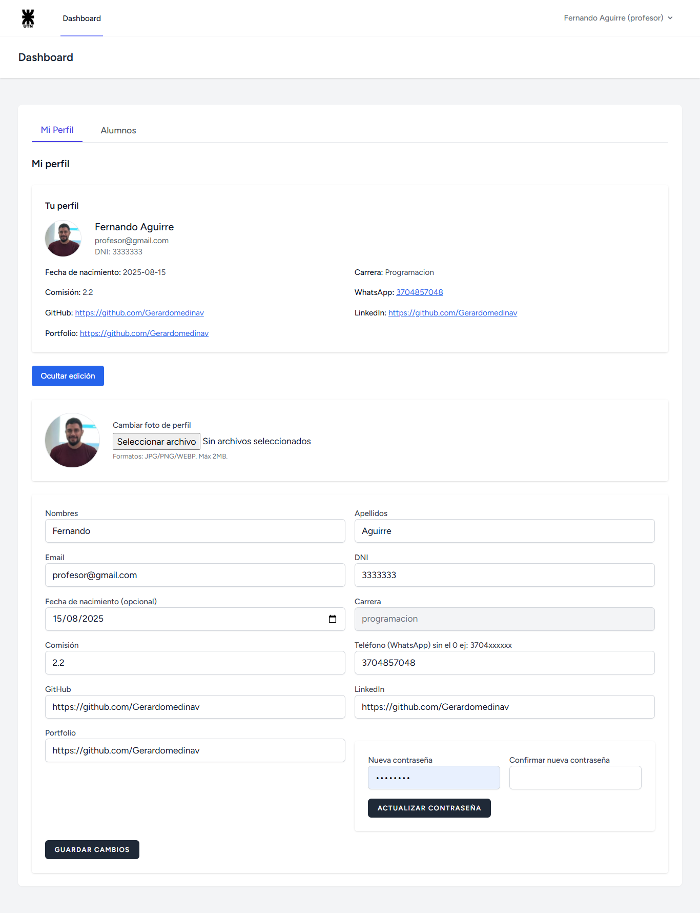
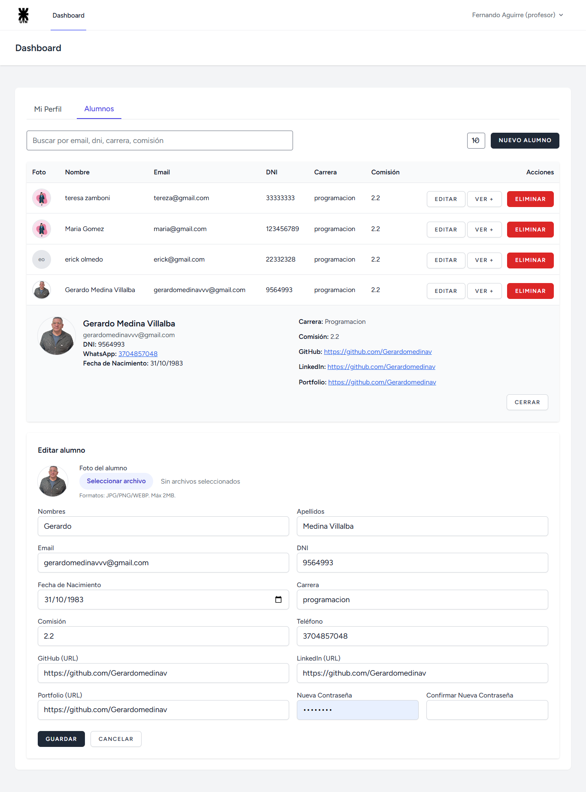
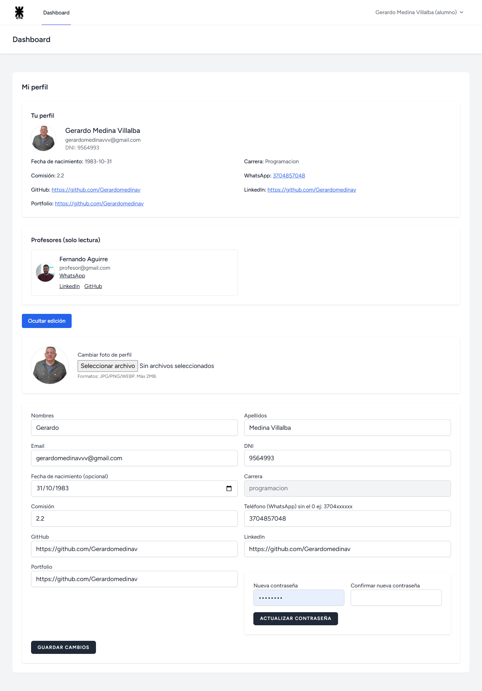

# AlumnosApp - Gestión Académica de Alumnos
- Trabajo Academico colaborativo de grupo de alumnos en la Materia de Programcion 4 - UTN 
- Profesor a cargo de la materia: Fernando Enrique Aguirre
- Colaboradores:

@D4vidR0j4s
Olmedo Rojas Eric David

@LeoArce98
Leonardo Agustín Arce


@Mtz1974
Maria Teresa Zamboni


@NahuelMasacote
Nahuel Masacote


[](https://php.net/)
[](https://laravel.com)


Plataforma web para gestión integral de estudiantes y docentes desarrollada con Laravel 12.

## 📌 Tabla de Contenidos
- [Características](#-características)
- [Tecnologías](#-tecnologías)
- [Instalación](#-instalación)
- [Capturas](#-capturas)


## 🚀 Características
- **Gestión de Roles**
  - Perfiles diferenciados para profesores y administradores
  - Middleware de autenticación personalizado
- **CRUD Estudiantil**
  - Registro completo con validación en tiempo real
  - Edición masiva de campos
- **Gestión Multimedia**
  - Subida segura de imágenes (JPG/PNG)
  - Sistema de almacenamiento con `storage:link`
- **Interfaz Avanzada**
  - Búsqueda inteligente con Livewire
  - Paginación dinámica
  - Exportación a CSV/Excel y PDF

## 🛠 Tecnologías
| Componente       | Tecnologías                                                                 |
|------------------|-----------------------------------------------------------------------------|
| **Backend**      | PHP 8.2, Laravel 12, Eloquent ORM, Livewire 3                              |
| **Frontend**     | Blade, TailwindCSS 3, Alpine.js, Vite                                      |
| **Base de Datos**| MySQL 8.0 (Optimizado para relaciones académicas)                          |


## 📥 Instalación

### Requisitos Previos
- PHP 8.2+
- Composer 2.5+
- Node.js 18+
- MySQL 8.0+

```bash
# 1. Clonar repositorio
git clone https://github.com/Gerardomedinav/AlumnosApp.git
cd alumnosapp

# 2. Instalar dependencias
composer install --no-dev
npm install --production

# 3. Configurar entorno
cp .env.example .env
php artisan key:generate

# 4. Configurar base de datos (editar .env)
nano .env

# 5. Migraciones y datos iniciales
php artisan migrate --seed
php artisan storage:link

# 6. Compilar assets
npm run build

# 7. Iniciar servidor
php artisan serve --port=8080
```

## 📸 Capturas de Pantalla

### Página de Inicio

*Vista principal del sistema con acceso al login y registro*

### Panel del Profesor

*Dashboard docente con estadísticas y herramientas de gestión*

### Listado de Alumnos

*Interfaz de gestión con filtros y paginación dinámica*

### Perfil de Estudiante

*Detalle completo con información académica y redes sociales*


---

